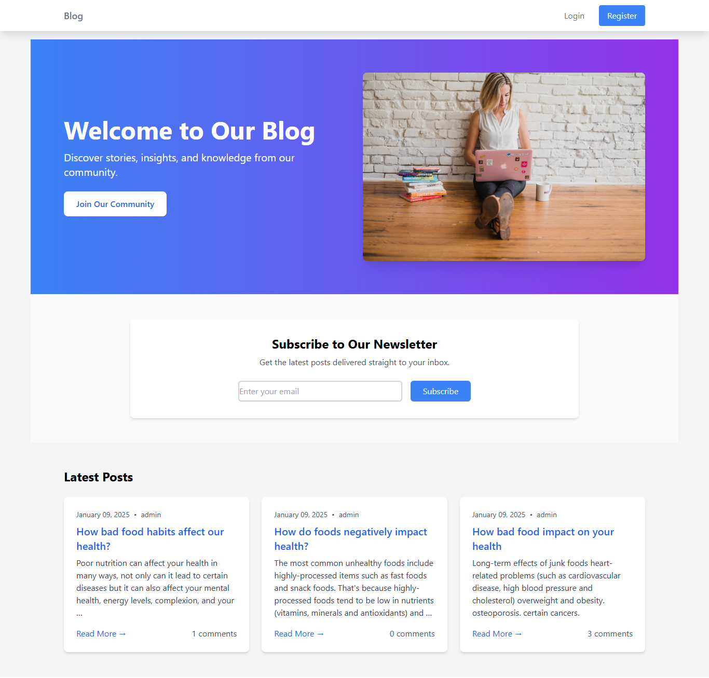
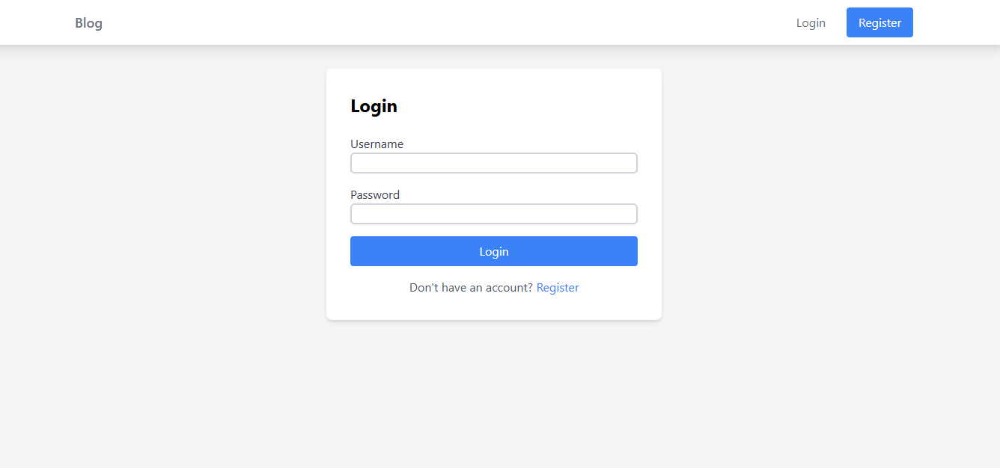
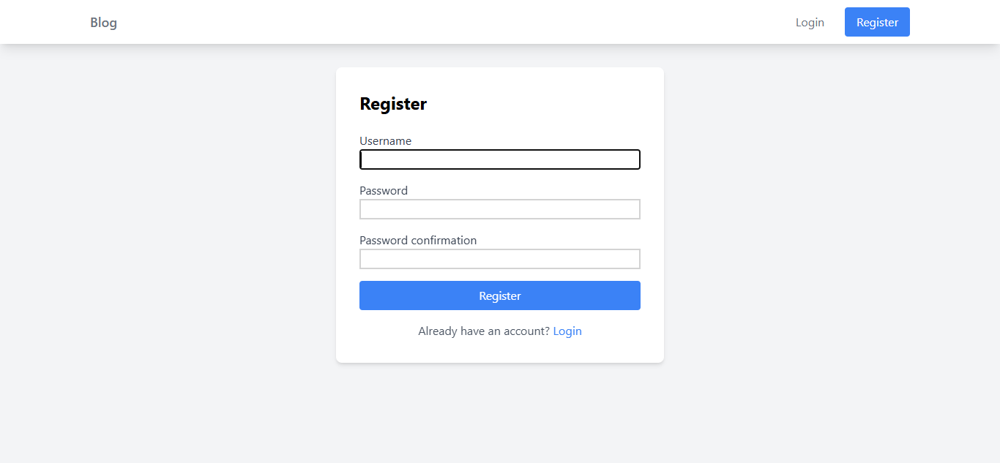
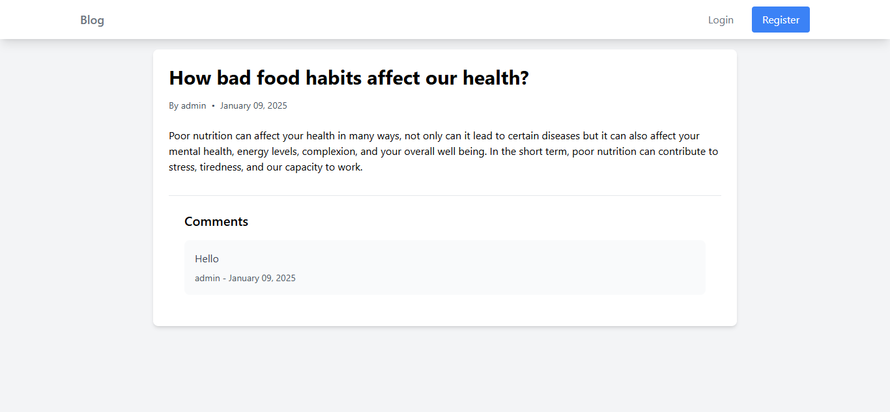
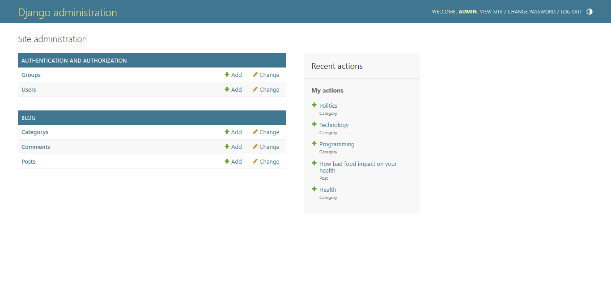

# Django Blog Website

Welcome to the **Django Blog Website** repository! This project is a simple yet feature-rich blog platform built using Django, a powerful Python web framework. It allows users to create, read, update, and delete blog posts, manage user authentication, and interact with an intuitive user interface.

## Features

- **User Authentication:**
  - Registration, Login, Logout
  - Password reset functionality

- **Blog Posts Management:**
  - Create, Read, Update, and Delete (CRUD) operations
  - List and detail views for blog posts

- **Rich Text Editing:**
  - Enhanced post creation with a WYSIWYG editor

- **Responsive Design:**
  - Fully functional on desktops, tablets, and mobile devices

- **Commenting System (Optional):**
  - Allow users to comment on blog posts

## Requirements

- Python 3.8+
- Django 4.0+
- PostgreSQL (optional, can use SQLite for development)
- Virtualenv or pipenv (recommended for dependency management)

## Installation

1. Clone the repository:

   ```bash
   git clone https://github.com/your-username/django-blog.git
   cd django-blog
   ```

2. Create and activate a virtual environment:

   ```bash
   python -m venv env
   source env/bin/activate   # On Windows use `env\Scripts\activate`
   ```

3. Install dependencies:

   ```bash
   pip install -r requirements.txt
   ```

4. Set up the database:

   - For SQLite (default):
     ```bash
     python manage.py migrate
     ```

   - For PostgreSQL (optional):
     Configure the database settings in `settings.py`, then:
     ```bash
     python manage.py migrate
     ```

5. Create a superuser:

   ```bash
   python manage.py createsuperuser
   ```

6. Run the development server:

   ```bash
   python manage.py runserver
   ```

   Visit `http://127.0.0.1:8000/` in your browser.

## Configuration

### Environment Variables

Create a `.env` file in the project root to configure sensitive settings:

```env
SECRET_KEY=your-secret-key
DEBUG=True
DATABASE_URL=your-database-url
```

### Static Files

Collect static files for production use:

```bash
python manage.py collectstatic
```

## Usage

1. Navigate to the homepage to view the list of blog posts.
2. Log in to create, edit, or delete posts (admin or authenticated users).
3. Explore the admin panel at `/admin` to manage the website.

## Screenshots
### HomePage

### Login

### Registration

### Single Post Page

### Create New Post Page

### Admin Panel Page

## Contributing

Contributions are welcome! Please follow these steps:

1. Fork the repository.
2. Create a new branch (`git checkout -b feature-name`).
3. Commit your changes (`git commit -m 'Add a new feature'`).
4. Push to the branch (`git push origin feature-name`).
5. Create a pull request.

## License

This project is licensed under the MIT License. See the [LICENSE](LICENSE) file for details.

## Acknowledgments

- Django Documentation: <https://docs.djangoproject.com/>
- Tailwindcss: <https://tailwindcss.com/>
- Any additional libraries or inspirations you used for the project.

---
Feel free to suggest improvements or report issues. Happy coding!